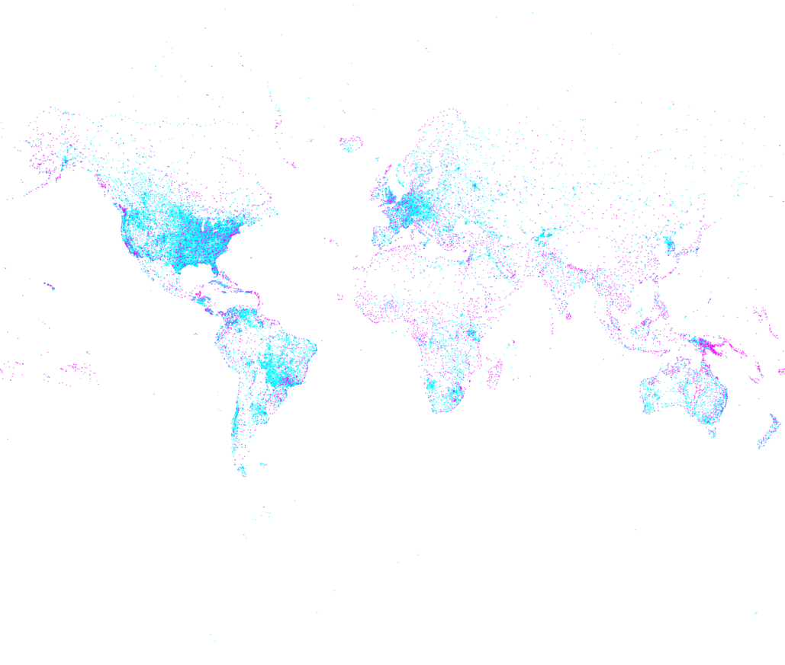

# Clojure/Clojurescript workshop

(WS-LDN-1) - WIP

## Day 1 namespaces

- [day1.csv](src/ws_ldn_1/day1/csv.clj) - CSV parsing & column extraction
- [day1.people](src/ws_ldn_1/day1/people.clj) - EDN parsing & transformation

Airport dataset from: http://ourairports.com/data/

## Day 2 namespaces

### Clojure SVG airport visualization

- [day2.mercator](src/ws_ldn_1/day2/mercator.clj) - Mercator projection
- [day2.svgmap](src/ws_ldn_1/day2/svgmap.clj) - SVG mercator map



47k airports mapped, data from [ourairports.com](http://ourairports.com/data/)

### Clojurescript, Reagent / React example

- [ui.day2.core](src-cljs/ws_ldn_1/day2/core.cljs) - basic concepts & undo demo

To launch (make sure you comment out invocation of `(main)` in day3.core ns):

```bash
lein figwheel day2
```

## Day 3 namespaces

- [ui.day3.core](src-cljs/ws_ldn_1/day3/core.cljs) - thi.ng/geom vizualization examples (using Reagent)

To launch (make sure you comment out invocation of `(main)` in day2.core ns):

```bash
lein figwheel day3
```

## Usage

TODO

## License

Copyright © 2015 Karsten Schmidt

Distributed under the Apache Software License either version 1.0 or (at
your option) any later version.
